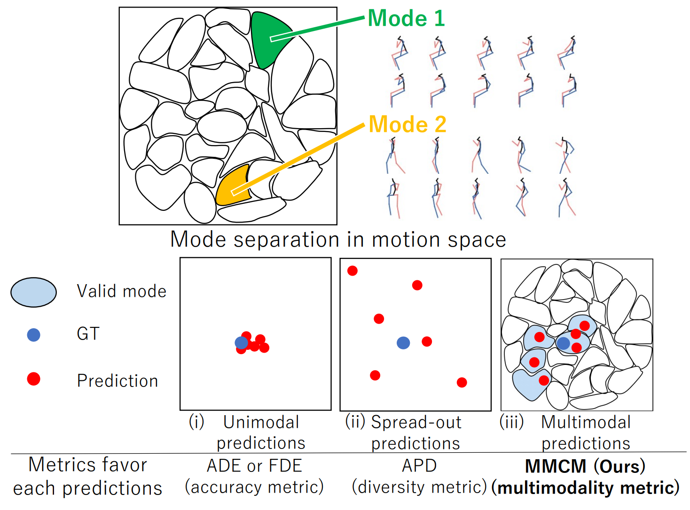

# MMCM: Multimodality-aware Metric using Clustering-based Modes for Probabilistic Human Motion Prediction
This is the official repository for the following paper:

Kyotaro Tokoro, Hiromu Taketsugu, Norimichi Ukita

MMCM: Multimodality-aware Metric using Clustering-based Modes for Probabilistic Human Motion Prediction, WACV 2026

[arxiv](https://arxiv.org/pdf/2511.15179), [suppl](https://www.toyota-ti.ac.jp/Lab/Denshi/iim/ukita/selection/WACV_tokoro_arXiv_supp.pdf)

<!-- <!--  -->

<p align="center">
  
</p>

## Environment

- Please install the appropriate version of PyTorch (e.g., v.2.3.0, v.2.6.0) for your environment.
Then, install the remaining dependencies by running:
```
pip install -r requirements.txt
```

## Prepare datasets

- Prepare Human3.6M and AMASS following [BeLFusion](https://github.com/BarqueroGerman/BeLFusion) in "./auxiliar".

## Prepare weights and so on

- Download [weights set](https://drive.google.com/file/d/1f-dc5uWKY5SxoKnmr3czIzFZXWi12F9E/view?usp=drive_link), unzip the file, and place it in './compute_mmcm/default_parms'.

## Compute MMCM
### From numpy output
- You can evaluate predictions saved in NumPy format (.npy).
- Please refer to ```save_baseline_as_npy.py``` for how to export your prediction results as an .npy file. By running this script, you can also save the outputs of a very simple baseline predictor.
- The output results for one method (BeLFusion) can be downloaded from [npy results](https://drive.google.com/drive/folders/1YLFb8TA-V2CxTwFgVnPafJevbxdc6VAb?usp=drive_link), and you unzip the file and place it in './baseline_output/belfusion/h36m/'. Please note that the resulting zip file is quite large (about 4.5 GB).

```
# Baseline --> {comusion, belfusion, dlow, and so on}
# Dataset --> {h36m, amass}
python evaluate_baseline.py --pred_path "baseline_output/<Baseline>/<Dataset>/npy/" --data_config_path "compute_mmcm/default_parms/<Dataset>/<Dataset>_config.json" --dataset_name <Dataset>
```

### Base form
- coming soon


## Hyperparameter search
If you want to do hyperparameter search on new datases, please use ```compute_mmcm/parameter_search.py``` script.

For example,
```
python compute_mmcm/parameter_search.py --data_config_path compute_mmcm/default_parms/h36m/h36_config.json --stride 25 --frames 103

python compute_mmcm/parameter_search.py --data_config_path compute_mmcm/default_parms/amass/amass_config.json --stride 60 --frames 123
```

